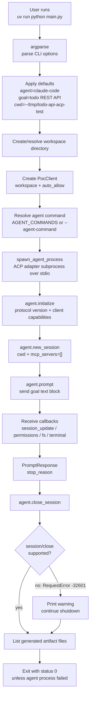
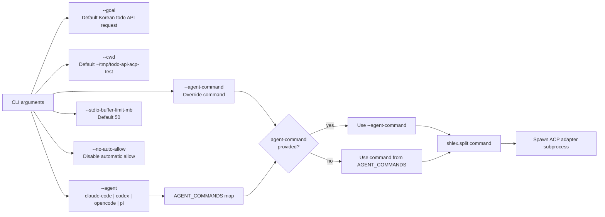
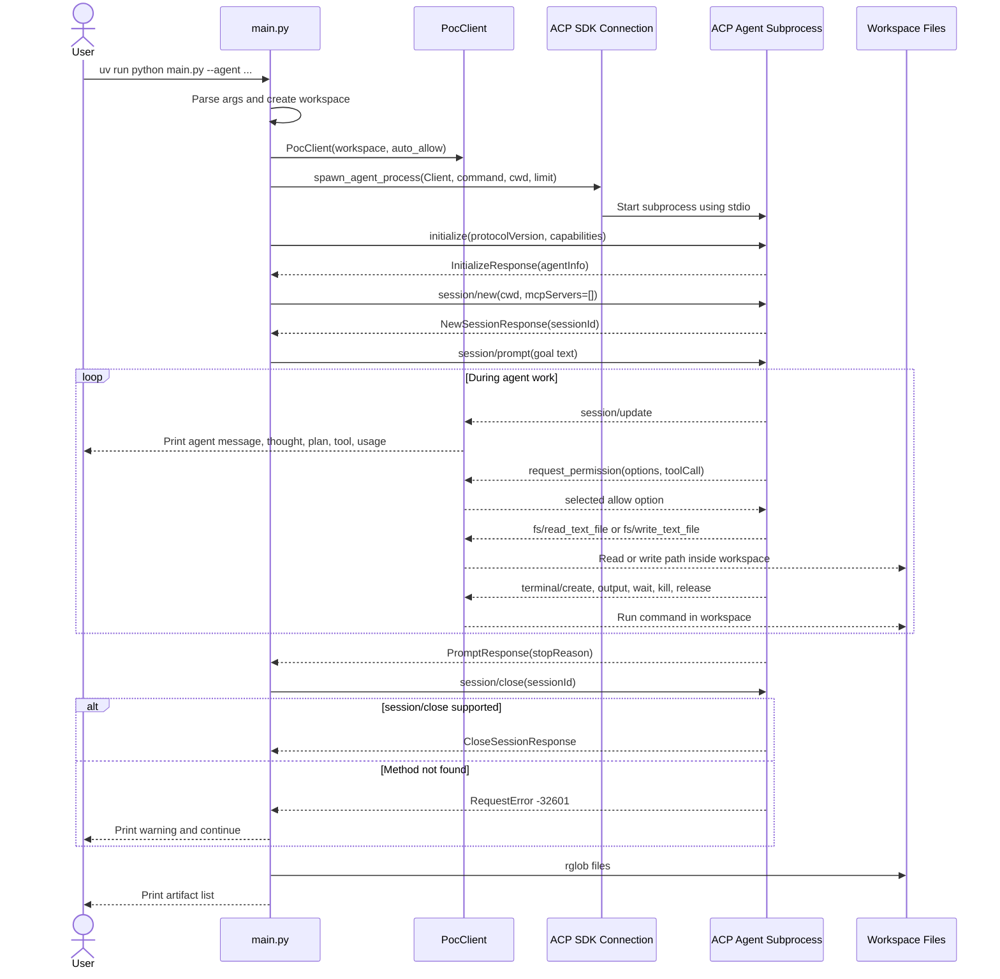
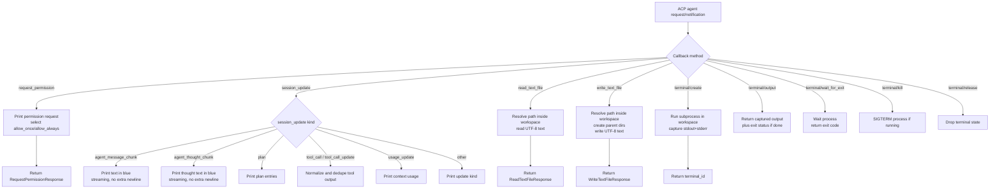
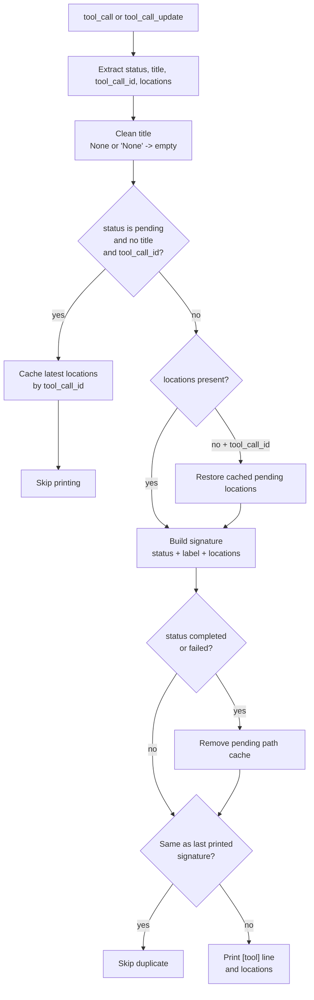
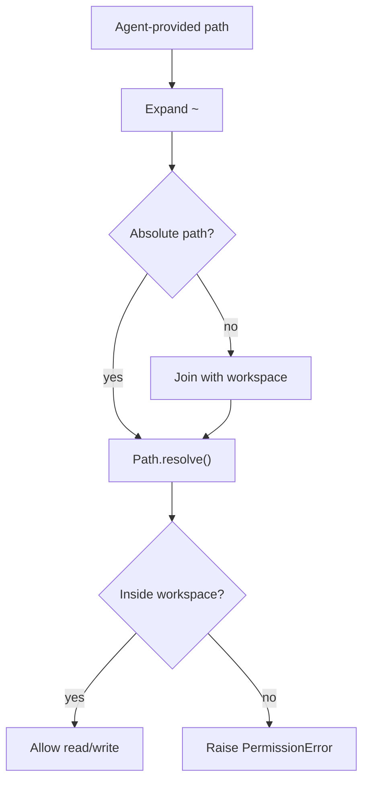
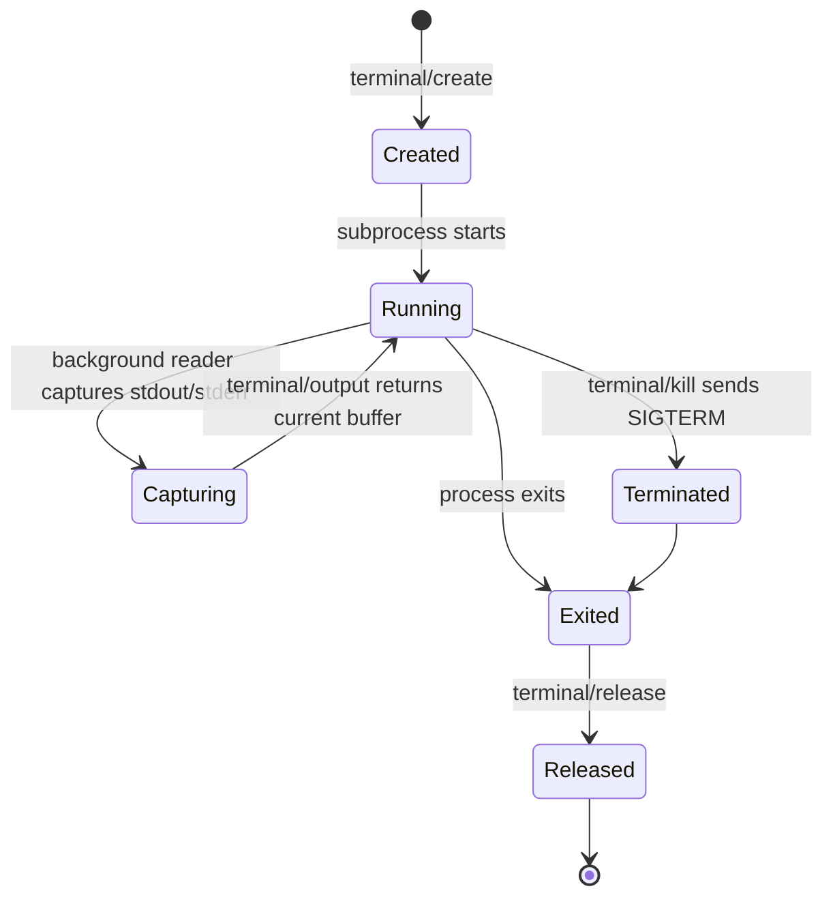
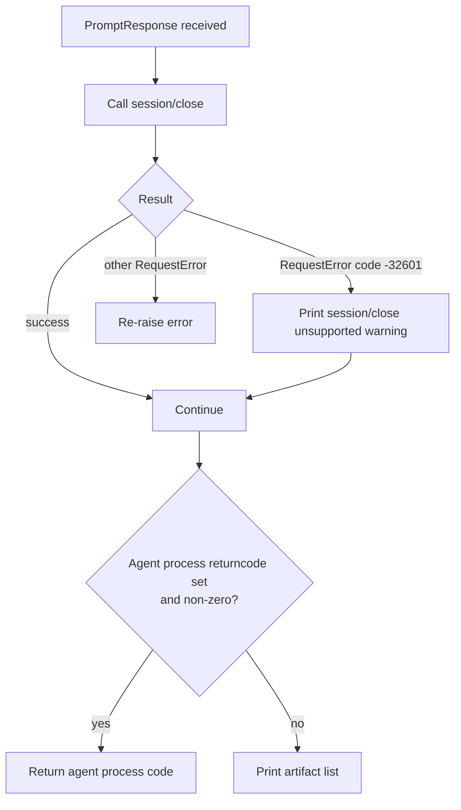
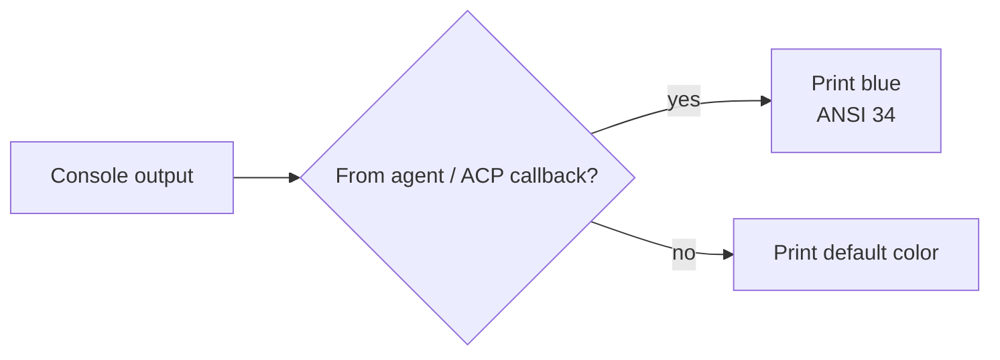

# Program Flow

이 문서는 `main.py`의 동작 방식을 Mermaid graph로 정리합니다.

POC의 핵심 목적은 Python ACP client가 coding agent ACP adapter를 subprocess로 실행하고, 목표 텍스트를 ACP `session/prompt`로 전달한 뒤, agent의 응답과 개발 산출물을 확인하는 것입니다.

## 전체 구조



## CLI Option Flow



현재 agent 기본 명령:

| Agent | Command |
| --- | --- |
| `claude-code` | `npx -y @agentclientprotocol/claude-agent-acp` |
| `codex` | `npx -y @zed-industries/codex-acp` |
| `opencode` | `npx -y opencode-ai acp` |
| `pi` | `npx -y pi-acp` |

## ACP Sequence



## `PocClient` Callback Router

`PocClient` implements the client-side ACP callbacks that an agent may call while processing a prompt.



## Tool Update Output Policy

The tool update output policy exists mainly to keep `pi-acp` output readable.



This avoids output such as:

```text
[tool] pending None
[tool] pending None
```

It also hides incremental path fragments like:

```text
src/in
src/infrastructure
src/infrastructure/persistence/JsonTodoRepository.js
```

and waits for a meaningful state transition before printing.

## Filesystem Safety

All ACP filesystem callbacks are constrained to the configured workspace.



This prevents an agent from using the POC filesystem callbacks to read or write outside the selected workspace.

## Terminal Handling



Terminal output is held in memory with a per-terminal byte limit. If the buffer grows beyond the limit, the oldest bytes are dropped.

## Error Handling



The `session/close` fallback exists because some ACP adapters, notably some OpenCode ACP versions, may not implement `session/close`.

## Color Policy



Agent messages, thoughts, plans, tool updates, permission requests, extension notifications, and extension method calls are printed in blue. POC control logs such as `[poc] workspace`, terminal lifecycle logs, filesystem write logs, and artifact lists use the default terminal color.
